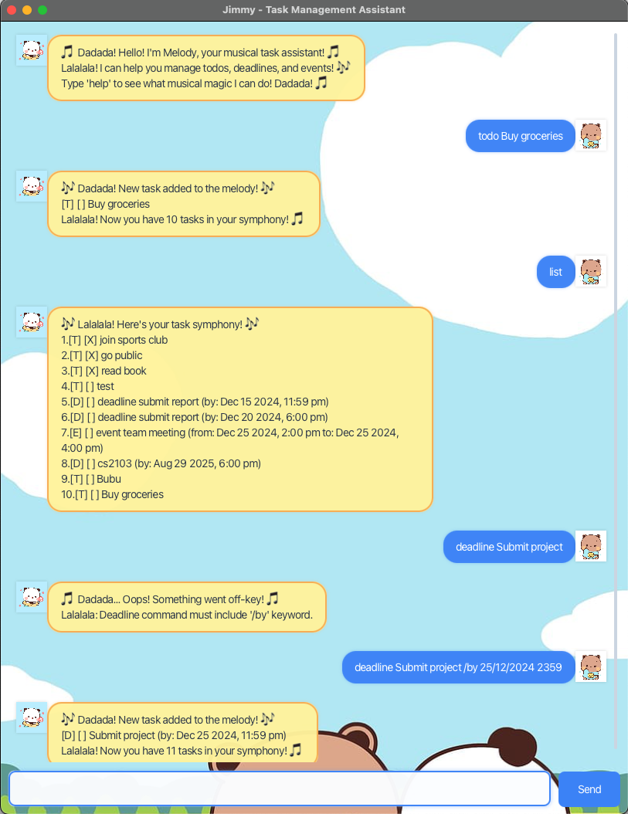

# Jimmy User Guide

Jimmy is a musical task management assistant that helps you organize your todos, deadlines, and events with a cheerful, musical personality! 🎵

## Features

Jimmy can help you with:
- **Todo tasks**: Simple tasks to remember
- **Deadline tasks**: Tasks with specific due dates
- **Event tasks**: Tasks with start and end times
- **Task management**: Mark tasks as done, delete tasks, find tasks
- **Musical personality**: Jimmy responds with musical phrases and emojis! 🎶

## Getting Started

Launch Jimmy and you'll be greeted by Melody, your musical task assistant! She'll guide you through the available commands.

### First Launch
When you first start Jimmy, you'll see:
- A welcome message from Melody with musical emojis 🎵
- A clean chat interface ready for your commands
- An input field at the bottom to type your tasks
- A Send button to submit your commands

### Product Screenshot


## Adding Tasks

### Adding Todo Tasks
Create simple tasks without specific dates:
```
todo Buy groceries
```
**Expected Output**: Jimmy will add the task and show a confirmation message with musical flair! 🎵

### Adding Deadline Tasks
Create tasks with specific due dates:
```
deadline Submit assignment /by 25/12/2024 2359
```
**Date Format**: Use `dd/MM/yyyy HHmm` format (e.g., 25/12/2024 2359 for Dec 25, 2024 at 11:59 PM)

### Adding Event Tasks
Create tasks with start and end times:
```
event Team meeting /from 25/12/2024 1400 /to 25/12/2024 1500
```
**Time Format**: Use 24-hour format (1400 = 2:00 PM, 1500 = 3:00 PM)

## Managing Tasks

### List All Tasks
View all your tasks:
```
list
```

### Mark Tasks as Done
Mark a task as completed:
```
mark 1
```

### Unmark Tasks
Mark a completed task as incomplete:
```
unmark 1
```

### Delete Tasks
Remove a task from your list:
```
delete 1
```

### Find Tasks
Search for tasks containing specific keywords:
```
find meeting
```

## Error Handling

Jimmy handles common errors gracefully with musical personality:

### Common Error Scenarios
- **Invalid commands**: Clear error messages with suggestions and musical phrases
- **Missing files**: Automatic file creation and recovery
- **Invalid dates**: Helpful format suggestions (e.g., "Expected formats: dd/MM/yyyy HHmm")
- **Index errors**: User-friendly messages with current task count
- **Missing parameters**: Specific guidance on what's required (e.g., "/by" for deadlines)
- **Duplicate keywords**: Detection of repeated keywords in commands

### Example Error Messages
```
❌ Error: Deadline command must include '/by' keyword.
🎵 Dadada! Don't worry, just add /by followed by your date! 🎵
```

## Advanced Features

### Task Persistence
- All tasks are automatically saved to `data/jimmy.txt`
- Tasks persist between application restarts
- No data loss even if the application crashes

### Search Functionality
- Case-insensitive search across all task descriptions
- Find tasks by keywords or phrases
- Search works with partial matches

## Getting Help

Type `help` to see all available commands and Jimmy's musical responses! 🎵

### Quick Reference
- `list` - Show all tasks
- `mark X` - Mark task X as done
- `unmark X` - Mark task X as not done
- `delete X` - Remove task X
- `find keyword` - Search for tasks
- `bye` - Exit the application